# . Immediate response to oxidative shock

## . Number of Differentially expressed genes under each time-point

```r
suppressPackageStartupMessages(library(tidyverse))
expression_file <- readr::read_tsv("https://raw.githubusercontent.com/sethiyap/Cg_oxidative_stress/master/CgH2O2_immediate_adaptation_OS_LFC.txt",  col_names = TRUE)
glimpse(expression_file)
## Observations: 5,263
## Variables: 5
## $ ORF   <chr> "CAGL0B03069g", "CAGL0D01298g", "CAGL0I02200g", "CAGL0J076…
## $ `5m`  <dbl> -0.048297538, -0.076480208, 0.000670171, 0.306464107, 0.24…
## $ `15m` <dbl> 1.04786322, 0.10699520, 0.29268980, 0.91228699, 1.75870830…
## $ `30m` <dbl> 2.1840691, 1.1594894, 1.0268700, 2.6502102, 2.4353285, 2.3…
## $ `4h`  <dbl> -1.697379, -2.728006, -2.208331, -1.875563, -4.267266, -2.…

expression_file_long <- expression_file %>% 
                              dplyr::select(-c("4h")) %>%
                              gather(Time, LFC,-ORF) %>%
                              mutate(Time=factor(Time, levels=unique(Time)), 
                                     class=if_else(LFC >=1, "Up", if_else(LFC <= -1, "Down", "No-change"))) %>%
                              group_by(Time, class) %>%
                              dplyr::summarise(n=n()) %>%
                              dplyr::filter(class!="No-change")
                              

plot_bar <- expression_file_long %>% 
                    arrange(desc(class)) %>%
                    mutate(class=factor(class, levels=unique(class))) %>%
                    ggplot(aes(Time, n, label=n, fill=Time))+geom_col()+
                    facet_wrap(~class, scales = "free_y")+
                    theme_bw()+
                    theme(axis.text = element_text(colour = "black", size=12),
                          panel.grid = element_blank())+
                    scale_fill_manual(values = c("#800000FF", "#767676FF", "#FFA319FF"))+
                    geom_text(vjust=-0.5, fontface="bold")+
                    labs(x="Time post oxidative stress", y="No. of genes")
```
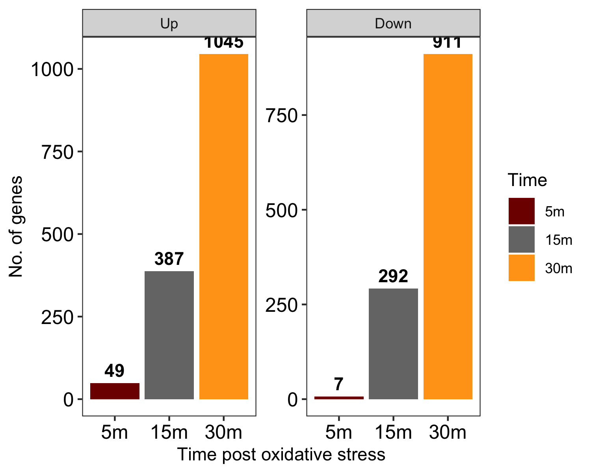

## . Distribution of genes expression

```r
expression_file_box <- expression_file %>% 
                              dplyr::select(-c("4h")) %>%
                              gather(Time, LFC,-ORF) %>%
                              mutate(Time=factor(Time, levels=unique(Time)), 
                                     class=if_else(LFC >=1, "Up", if_else(LFC <= -1, "Down", "No-change"))) %>%
                              dplyr::filter(class!="No-change")
                              

plot_box <- expression_file_box %>% 
                    arrange(desc(class)) %>%
                    mutate(class=factor(class, levels=unique(class))) %>%
                    dplyr::filter(LFC < 3 & LFC > -3) %>%
                    ggplot(aes(Time, LFC, fill=Time))+geom_boxplot()+
                    facet_wrap(~class, scales = "free_y")+
                    theme_bw()+
                    theme(axis.text = element_text(colour = "black", size=12),
                          panel.grid = element_blank())+
                    scale_fill_manual(values = c("#800000FF", "#767676FF", "#FFA319FF"))+
                    labs(x="Time post oxidative stress", y="log2FC")
```
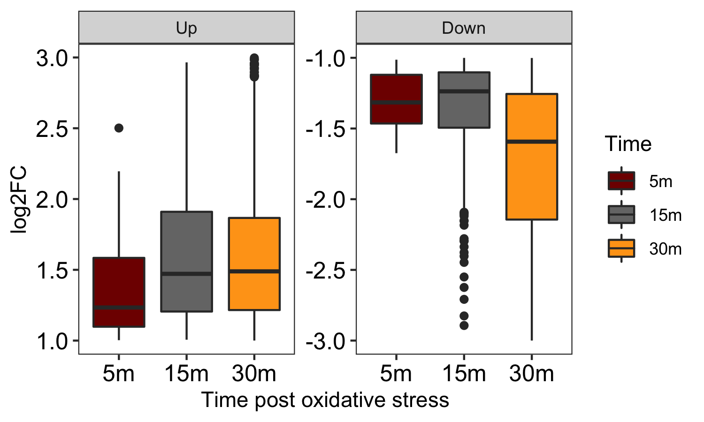

## . Overlapping genes upon oxidative shock

```r
library(UpSetR)
dat_venn1 <-  read.table("https://raw.githubusercontent.com/sethiyap/Cg_oxidative_stress/master/CgH2O2_immediate_venn_input.txt", sep="\t", header=TRUE)
gg_1 = as.list(dat_venn1)

v1 = lapply(gg_1,unique)

c1 = lapply(v1, function(x) x[!x %in% ""])
lengths(c1)
## Down_30m Down_15m  Down_5m   Up_30m   Up_15m    Up_5m 
##      911      292        7     1045      387       49

names(c1)=factor(names(c1))
upset_venn1 <- upset(fromList(c1), 
          nsets = ncol(dat_venn),
          order.by = c("degree"),
          keep.order=TRUE,sets=names(c1),
          sets.bar.color = c( "blue","blue","blue", "red", "red", "red"),
          text.scale=2, sets.x.label = "No. of genes")

print(upset_venn1)
```


## . Classification of genes based on expression in acute oxidative stress across time-point

```r

group_genes <- expression_file %>% 
                    dplyr::select(-c("4h")) %>%
                    mutate(Group = if_else( `15m` >= 1 & `30m` >= 1 & `5m` > -1 & `5m` < 1, "Group I", 
                                            if_else(`30m` >= 1 & `15m` > -1 & `15m` < 1 & `5m` > -1 & `5m` < 1, "Group II",
                                                    if_else( `15m` <= -1 & `30m` <= -1 & `5m` > -1 & `5m` < 1,"Group III", 
                                                             if_else(`30m` <= -1 & `15m` > -1 & `15m` < 1 & `5m` > -1 & `5m` < 1, "Group IV", "Group V"))))) %>% filter(Group != "Group V") %>% 
          gather(Time, LFC,-Group, -ORF) %>% mutate(Time=factor(Time,levels = unique(Time))) %>%
          arrange(Group)

plot_line <- group_genes %>% ggplot(aes(Time, LFC, group=ORF, color=Group))+geom_line()+
                              facet_wrap(~Group, ncol = 2, scales="free_y")+theme_bw()+
                              labs(x="Time post oxidative stress", y="log2FC")+
                              scale_color_manual(values=c("#8A9045FF", "#FFA319FF", "#800000FF", "#155F83FF"))+
                              theme(axis.text = element_text(colour = "black", size=12))+
          geom_hline(yintercept = c(1,-1), linetype=2)
```
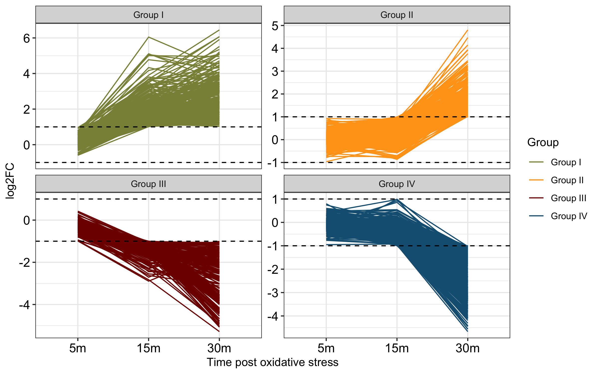

## . Functional analysis of genes within each group. 
GO analysis was performed for each group using FungiDb


```r

dat_go <- readr::read_tsv("https://raw.githubusercontent.com/sethiyap/Cg_oxidative_stress/master/CgH2O2_immediate_lineplotGO.txt",  col_names = TRUE)
                                                             
glimpse(dat_go)
## Observations: 30
## Variables: 5
## $ Name         <chr> "alpha-amino acid biosynthetic process", "antibioti…
## $ Bgd_count    <dbl> 86, 54, 8, 3, 3, 8, 38, 281, 128, 19, 285, 291, 185…
## $ Result_count <dbl> 13, 14, 5, 3, 2, 5, 11, 51, 27, 7, 96, 92, 66, 44, …
## $ Pvalue       <dbl> 3.992280e-04, 3.380000e-07, 7.000000e-06, 1.354740e…
## $ group        <chr> "Group I", "Group I", "Group I", "Group I", "Group …

GO_group <- dat_go %>% 
          dplyr::mutate( percent=100*(Result_count/Bgd_count), 
                 Pvalue=-log10(Pvalue), Pvalue=if_else(Pvalue>25, 25, if_else(Pvalue< 25 & Pvalue>18, 18, Pvalue ))) %>%
                    dplyr::mutate(Name = forcats::fct_reorder(Name , Pvalue)) %>% 
                    dplyr::group_by(group) %>% 
                    ggplot(aes(Name, percent))+
                    geom_col(aes( fill=group, alpha=Pvalue, color=group))+
                    geom_text(aes(label=Result_count),color="black",hjust=-0.5)+
                    coord_flip()+
                    facet_wrap(vars(group),  scales = "free",  strip.position="left", ncol=2) +
                    scale_fill_manual(values = c("#8A9045FF", "#FFA319FF", "#800000FF", "#155F83FF"))+
                    scale_color_manual(values = c("#8A9045FF", "#FFA319FF", "#800000FF", "#155F83FF"))+
                    theme_bw()+
                    scale_y_continuous(trans = "reverse")+
                    scale_x_discrete(position = "top")+
                    labs(y="%(Significant/Total)", x="")+
                    theme(panel.grid = element_blank(),
                          axis.text = element_text(color="black", size=12),
                          legend.position = "bottom", legend.direction = "horizontal")+
          guides(fill=FALSE, color=FALSE)
ggsave(GO_group, filename = "CgH2O2_lineplot_GO.png", width=10, height =7 )
```
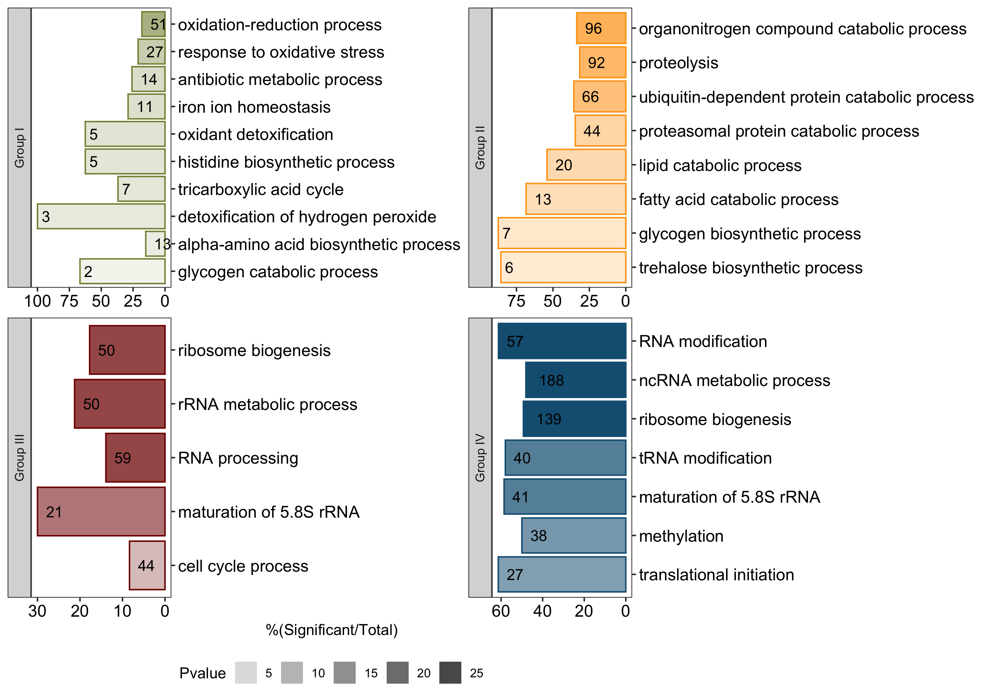

# . Adaptation to oxidative stress

## . Growth curve

```r
library(ggalt)

dat_growth_curve <- readr::read_tsv("https://raw.githubusercontent.com/sethiyap/Cg_oxidative_stress/master/CgH2O2_growthCurve_forplot.txt", col_names = TRUE) 

dat_melt <- dat_growth_curve %>% gather(key="sample", value="OD", -Time) %>% 
          separate(col = sample,into = c("condition","replicate"),sep="_")


summ_dat <- dat_melt %>% 
          dplyr::mutate(condition=as_factor(condition)) %>% 
          dplyr::group_by(.dots = c("Time", "condition"))  %>% 
          dplyr::mutate(sd = sd(OD), mean=mean(OD)) %>%
          dplyr::filter(replicate==min(replicate)) %>% select(-c(replicate)) 

gg_growth <- ggplot(summ_dat,aes(Time, mean, color=condition))+geom_line(lwd=0.8)+
          theme_bw()+ geom_point(size=1)+
          theme(panel.grid = element_blank(),
                axis.text = element_text(color="black", size=12))+
          scale_color_manual(values=c("#800000FF", "#FFA319FF", "#8A9045FF", "#155F83FF"))+ labs(x="Time (in hours)", y="OD600")+
          geom_errorbar(aes(ymin=mean-sd, ymax=mean+sd), width=.2,position=position_dodge(0.05))
```
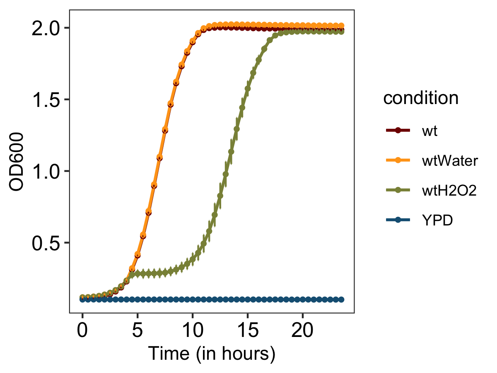

## . RNAP subunits expression

```r

dat_rnap <- read_delim("CgH2O2_adaptation_RNAP.txt", delim="\t", col_names = TRUE)

glimpse(dat_rnap)
## Observations: 30
## Variables: 6
## $ ORF           <chr> "CgRPC82", "CgRET1", "CgRPC31", "CAGL0H08415g", "C…
## $ `5m`          <dbl> -0.200823570, 0.245609093, 0.290560220, -0.3178781…
## $ `15m`         <dbl> -0.95087031, -0.26152172, -0.18468825, -0.87028578…
## $ `30m`         <dbl> -2.9608283, -2.5231335, -2.5906726, -3.1040271, -3…
## $ `4h`          <dbl> -1.55504603, -0.04695025, 1.43734991, 1.61704269, …
## $ RNAP_subunits <chr> "III", "III", "III", "III", "III", "III", "III", "…

rnap_plot <- dat_rnap %>%
                    dplyr::select(c("ORF", "4h", "RNAP_subunits")) %>%
                    mutate( ORF=factor(ORF, levels=unique(ORF))) %>%
                    ggplot(aes(ORF, `4h`, fill=RNAP_subunits))+geom_col()+
                    labs(y="log2FC", x="")+
                    coord_flip()+
                    scale_fill_manual(values=c("#767676FF", "#800000FF", "#FFA319FF","#8A9045FF"))+ 
                    theme_bw()+ geom_hline(yintercept = c(-1,1))
```
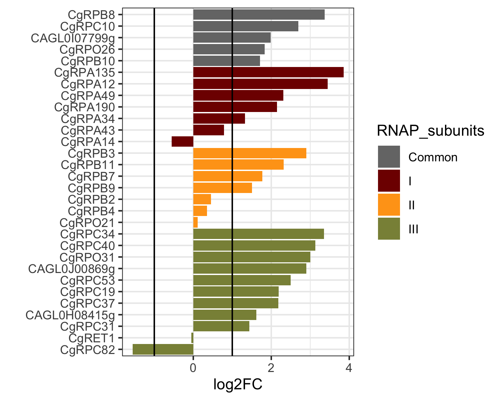

## . RNA degradation 

```r

dat_rnad <- readr::read_tsv("https://raw.githubusercontent.com/sethiyap/Cg_oxidative_stress/master/CgH2O2_adaptation_RNAdegradation.txt", col_names = TRUE)

glimpse(dat_rnad)
## Observations: 60
## Variables: 2
## $ ORF <chr> "CgDCS1", "CgENO1", "CAGL0I05698g", "CgMOT2", "CgDHH1", "CgL…
## $ lfc <dbl> -3.0116583, -1.1266304, -1.1219971, -1.1195330, -0.8840226, …

rnad_plot <- dat_rnad %>%
                    dplyr::arrange(desc(lfc)) %>%
                    mutate( ORF=factor(ORF, levels=unique(ORF))) %>%
                    ggplot(aes(ORF, lfc))+geom_col()+
                    labs(y="log2FC", x="")+
                    scale_fill_manual(values=c("#767676FF"))+ 
                    theme_bw()+ geom_hline(yintercept = c(-1,1))+
                    theme(axis.text.x = element_text(color="black", angle=90, size=5),
                          axis.text.y = element_text(color="black")
                          )
```
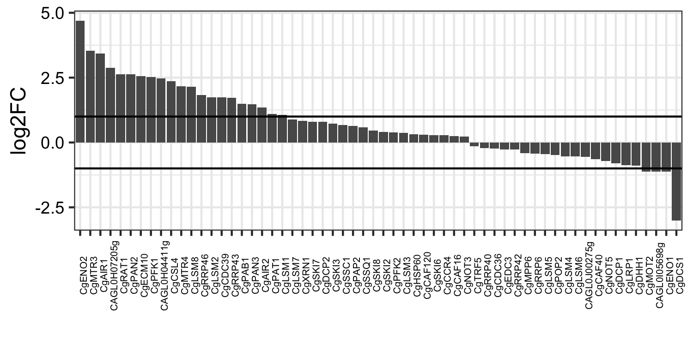


# . Acute and adapted oxidative stress response comparison

## . Differentially expressed genes during immediate and adaptation to OS


```r

deg_plot <- dat_deg %>% gather(class,count, -Gene) %>% 
            dplyr::arrange(desc(Gene)) %>% 
            mutate(class=factor(class, levels = unique(class)), Gene=factor(Gene, levels = unique(Gene))) %>%
                    ggplot(aes(Gene, count, fill=class, label=count))+geom_col(position = "dodge", color="black", alpha=0.8)+
                    scale_fill_manual(values=c("#800000FF", "#155F83FF"))+labs(x="", y="No. of genes")+
                    geom_text(color="white",size=3, position=position_dodge(width=0.9), vjust=1.2)+
                    theme_bw()+
                    theme(panel.grid = element_blank())
```
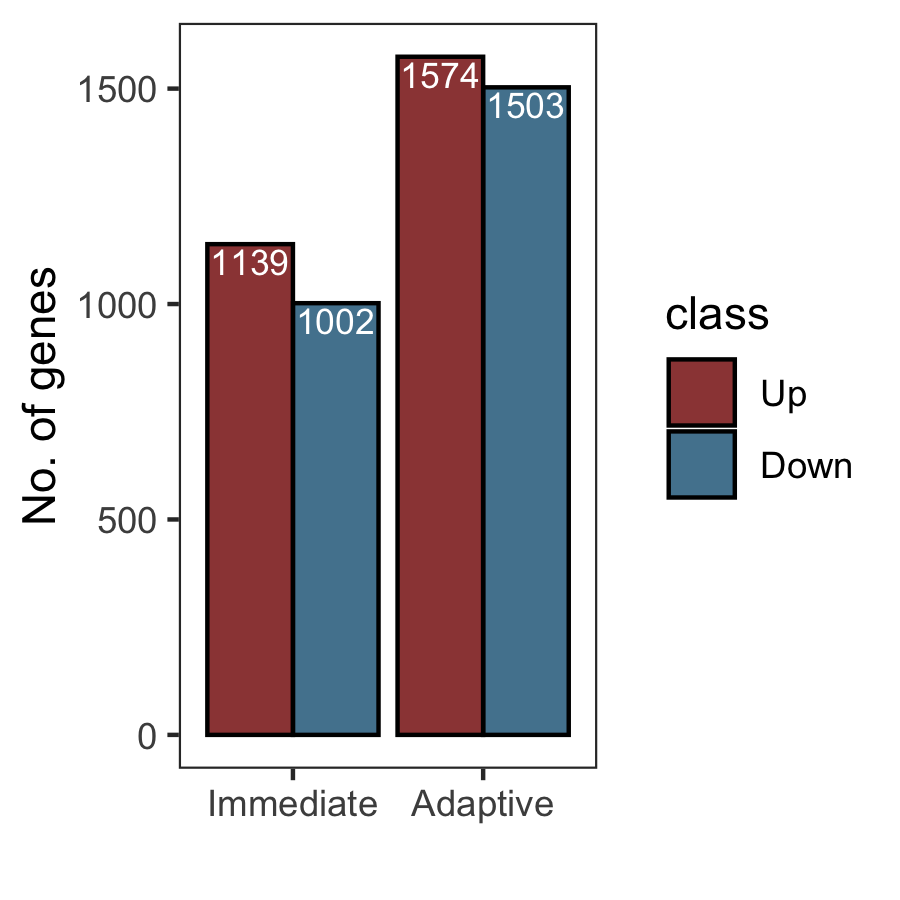

## . Genes overlapping between immediate and adaptation to OS

```r

library(UpSetR)
dat_venn <-  read.table("https://raw.githubusercontent.com/sethiyap/Cg_oxidative_stress/master/CgH2O2_immediate_adaptation_venn_input.txt", sep="\t", header=TRUE)
gg = as.list(dat_venn)

v = lapply(gg,unique)

c = lapply(v, function(x) x[!x %in% ""])
lengths(c)
##     adapt_Down       adapt_Up immediate_Down   immediate_Up 
##           1503           1574           1002           1139

names(c)=factor(names(c))
upset_venn <- upset(fromList(c), 
          nsets = ncol(dat_venn),
          order.by = c("degree"),
          keep.order=TRUE,sets=names(c),
          sets.bar.color = c( "blue","blue", "red", "red"),
          text.scale=2, sets.x.label = "No. of genes")

print(upset_venn)
```


## . Functional enrichment of oxidative stress response genes

```r

dat_acute_adapt <- readr::read_tsv("https://raw.githubusercontent.com/sethiyap/Cg_oxidative_stress/master/CgH2O2_immediate_adaptation_GO.txt", col_names = TRUE)

glimpse(dat_acute_adapt)
## Observations: 41
## Variables: 5
## $ Name         <chr> "lipid catabolic process", "antibiotic metabolic pr…
## $ Bgd_count    <dbl> 37, 54, 15, 11, 285, 10, 128, 291, 29, 19, 3, 8, 3,…
## $ Result_count <dbl> 20, 24, 11, 9, 62, 8, 33, 57, 12, 9, 3, 4, 2, 2, 94…
## $ Pvalue       <dbl> 2.650000e-10, 8.190000e-10, 3.580000e-08, 1.410000e…
## $ group        <chr> "Up_Down", "Up_Down", "Up_Down", "Up_Down", "Up_Dow…
dat_acute_adapt_plot <- dat_acute_adapt %>% 
                              dplyr::mutate(percent=100*(Result_count/Bgd_count), Pvalue=-log10(Pvalue)) %>%
                              dplyr::mutate(Name = forcats::fct_reorder(Name , Pvalue)) %>% 
                              dplyr::mutate(group=factor(group, levels=unique(group))) %>%
                              dplyr::group_by(group) %>%
                                        ggplot(aes(Name, percent))+geom_col(aes(fill=group, alpha=Pvalue, color=group))+ 
                                        coord_flip()+
                                        facet_wrap(vars(group),  scales = "free",  ncol=2) +
                                        geom_text(aes(label=Result_count), color="black",hjust=-0.5)+
                                        scale_fill_manual(values = c( "#CC8214FF","#0F425CFF", "#8A9045FF","#8F3931FF"))+
                                        scale_color_manual(values = c( "#CC8214FF","#0F425CFF", "#8A9045FF","#8F3931FF"))+theme_bw()+
                                        scale_y_continuous(trans = "reverse")+
                                        scale_x_discrete(position = "top")+
                                        scale_alpha(breaks=c(5,10,20))+ labs(y="%(Significant/Annotated)", x="")+
                                        theme(panel.grid = element_blank(),
                                                  axis.text = element_text(colour = "black", size=12))
```
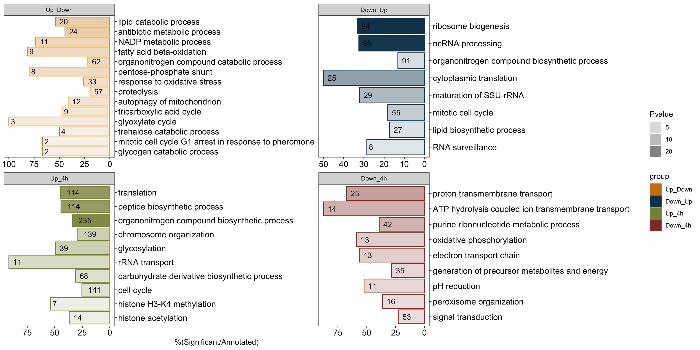

# . Antagonistic metabolic processes

```r

expression_file <- readr::read_tsv("https://raw.githubusercontent.com/sethiyap/Cg_oxidative_stress/master/CgH2O2_immediate_adaptation_OS_LFC.txt",  col_names = TRUE)

dat_boxplot <- expression_file %>% dplyr::select(c("ORF", "4h"))

mylist <- readr::read_tsv("https://raw.githubusercontent.com/sethiyap/Cg_oxidative_stress/master/CgH2O2_adaptation_oppositePathways.txt", col_names = TRUE)
          
gg_antagonsitic_pathways <- mylist %>% inner_join(dat_boxplot, by=c("group_member"="ORF")) %>%
          ggplot(aes(name, `4h`, fill=name))+geom_boxplot(notch = FALSE, notchwidth = 0.5)+
          facet_wrap(~group, scales = "free", ncol=2)+
          geom_jitter(alpha=0.5, aes(color=name))+
          theme_bw()+
          scale_fill_manual(values=c("#616530FF", "#CC8214FF"))+
          scale_color_manual(values=c("#616530FF", "#CC8214FF"))+
          theme(panel.grid = element_blank())+
          labs(x="", y="Log2FC")+
          guides(fill=FALSE, color=FALSE)
```
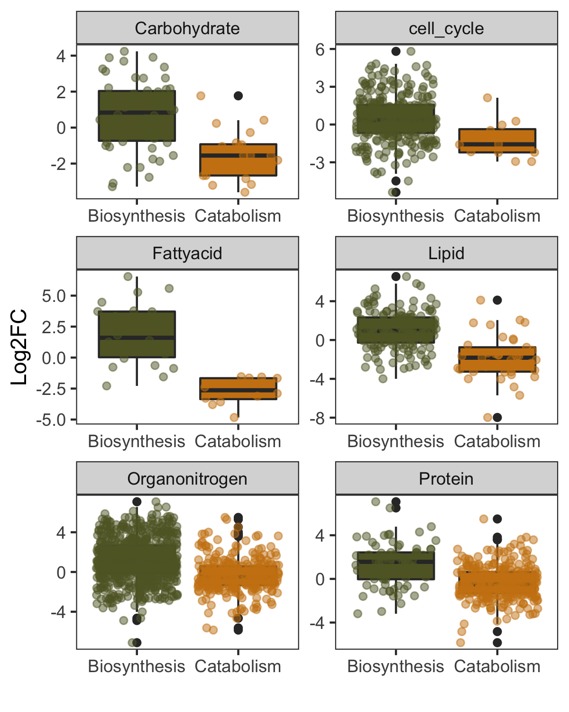

# . Virulence, biofilm formation and drug transport genes

```r

dat_virulence <- readr::read_tsv("https://raw.githubusercontent.com/sethiyap/Cg_oxidative_stress/master/CgH2O2_biofilm_drug_virulence.txt",  col_names = TRUE)

dat_virulence_plot <- dat_virulence %>% dplyr::select(-c(adapt, Class)) %>%
          gather(time, value, -gene_name) %>%
          group_by(gene_name) %>%
          mutate(immediate =  if(any(value > 1)) {2} else if(any(value < -1)){-2} else {0}) %>%
          dplyr::select(-c(time, value)) %>%
          unique() %>%
          left_join(dat_virulence, by=c("gene_name")) %>%
          dplyr::select(c(gene_name,immediate, adapt, Class )) %>% gather(time, value,-gene_name, -Class) %>%
          mutate(class=if_else(value > 1, "Induced", if_else(value< -1, "Repressed", "Same")))

virulence_plot <- dat_virulence_plot %>% 
         ungroup() %>%
         group_by(class) %>%
         arrange(desc(time), .by_group=TRUE) %>%
         mutate(time=factor(time, levels = unique(time))) %>%
          ggplot(aes(time, gene_name)) + 
          geom_tile(colour = "gray50",fill="white", size=0.25, width=0.9) + theme_bw()+ facet_wrap(~Class, scales="free_y", strip.position = "right")+
          geom_point(aes(color=class), size=2.5)+
          scale_color_manual(values=c( "red2","blue2","wheat3"))+
          scale_x_discrete(position="top")+
          theme(axis.text= element_text(color="black",size=12),
                axis.title=element_blank(),
                strip.text = element_text(face="bold", size=14),
                legend.title=element_text(color="black",size=10),
                legend.key.size = unit(1.5,"line"), panel.grid = element_blank())
```
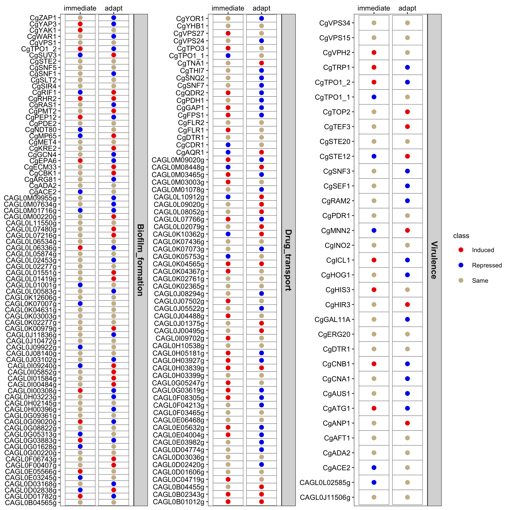


